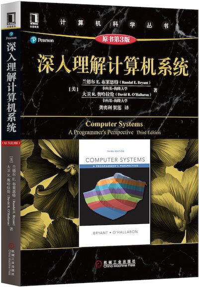

# Awesome-CS-APP-Notes-and-Labs
#### Proposition:CS:APP(Computer Systems:A Programmer's perspective) key interpretation ,Notes and Labs.

### 1. Prepare
- [C语言程序设计K&R_ch](Books/C_language_K&R_ch.pdf)
- [C语言程序设计K&R_en](Books/C_language_K&R_en.pdf)
- [CS:APP_EN](Books/CSAPP(3rd)English.pdf)

### 2.Notes
TODO
### 3.Labs
TODO
